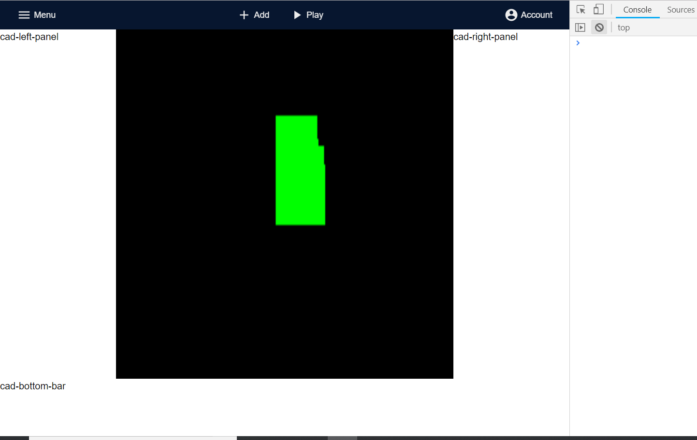

# Threecad, Just started, in development

Building a neat web-based 3D editor on top Three.js using WebComponents.

You will be able to insert the editor in your website as any other Webcomponent.

I'am using @polymer LitElement with Typescript for creating the customElements, Redux for the state management and of course Three.js for the rendering.

The app will be deployed as a PWA so that it works offline

Current status: 👇

